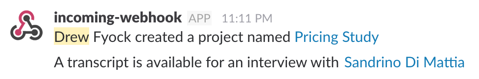

# Slack Notification webtask

The `slacker` webtask implements inbound slack notifications for a few specific events that occur in another application. This webtask actually mirrors functionality I recently added to my current application using AWS SNS and Lambda services, but proved much easier to accomplish with a webtask.

The possible events are:
- `create`
- `update`
- `sync`
- `complete`

The models for which these actions could occur are:
- `project`
- `interview`
- `transcript`

## Examples

### Project Created
For example, the research application could send data like:
```
{
  "subject": "Drew Fyock",
  "action": "create",
  "model": "project",
  "object": "Pricing Study",
  "link": "https://projects.voyantapp.com/projects/585c340c0bc9fa001bfb2a63"
}
```

### Transcription Completed
As another example, audio transcription is completed asynchronously via a 3rd party service. Once that data is returned to the application, it would send event data like this:
```
{
  "subject": "A transcript",
  "action": "complete",
  "model": "transcript",
  "object": "Sandrino Di Mattia",
  "link": "https://projects.voyantapp.com/sessions/58c9b047962289a9e10038e3"
}
```

### Output
Each request to the webtask creates a message in the Slack channel corresponding to the default (secret) webhook. Here is some actual output from the webtask to a personal Slack channel:


